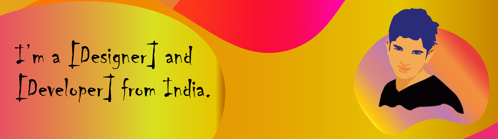

<h1 align="center">Hi 👋, I'm Sharan</h1>
<h3 align="center">A passionate developer and designer from India.</h3>

 
 

  

  

- 🔭 I’m currently working on **Learning Application**.

- 🌱 I’m currently learning **many things day by day**.

- 👯 I’m looking to collaborate on **React Projects**.

- 🤝 I’m looking for help with **[NULL]**.

- 👨‍💻 All of my projects are available at [building](building).

- 📝 I regulary write articles on [[NULL]]([NULL]).

- 💬 Ask me about **react, bootstrap, material-ui, semantic-ui, etc,.**

- 📫 How to reach me **karthikeyansharan00@gmail.com**

- 📄 Know about my experiences [[NULL]]([NULL]).

- ⚡ Fun fact **[NULL]**.

<!--### Blogs posts-->
<!-- BLOG-POST-LIST:START -->
<!-- BLOG-POST-LIST:END -->

<h3 align="left">Connect with me:</h3>

<h3 align="left">Languages and Tools:</h3>

                           

&nbsp;

